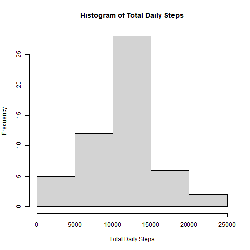
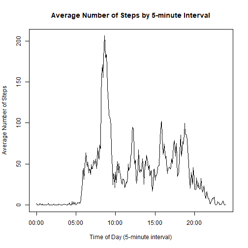
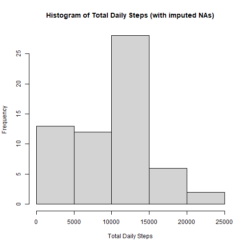
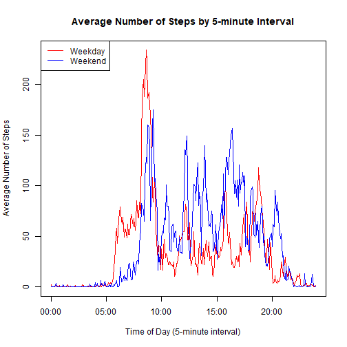

The data for this assignment was downloaded from the course web site:

Dataset: [Activity monitoring data [52K]](https://d396qusza40orc.cloudfront.net/repdata%2Fdata%2Factivity.zip)

The variables included in this dataset are:

**steps**: Number of steps taking in a 5-minute interval (missing values are coded as \color{red}{\verb|NA|}NA)

**date**: The date on which the measurement was taken in YYYY-MM-DD format

**interval**: Identifier for the 5-minute interval in which measurement was taken

The dataset is stored in a comma-separated-value (CSV) file and there are a total of 17,568 observations in this dataset.

This is the code to read the data and convert the date into a usable format.


```r
library(dplyr)
data <- read.csv("activity.csv",na.strings="NA")
data <- mutate(data, date = as.Date(date,"%Y-%m-%d"))
```

### What is mean total number of steps taken per day?
This code generates a histogram of the total number of steps taken each day. This formula excludes NA values.

```r
daily.steps <- data %>% filter(!is.na(steps)) %>% group_by(date) %>% summarize(steps = sum(steps))
hist(daily.steps$steps,xlab="Total Daily Steps",main="Histogram of Total Daily Steps")
```



This code generates the mean and median steps taken each day. Again, these formuals exclude NA values.

```r
steps.mean <- mean(daily.steps$steps)
steps.median <- median(daily.steps$steps)
```

The mean number of steps each day is 1.0766189 &times; 10<sup>4</sup> steps. 
The median number of steps each day is 10765 steps.


### What is the average daily activity pattern?
This code generates the time series plot of the average number of steps taken. The interval data is converted into continuous time.

```r
average.steps <- data %>% filter(!is.na(steps)) %>% group_by(interval) %>% summarize(steps = mean(steps))
average.steps$time <- as.POSIXct(sprintf("%04.0f", average.steps$interval), format='%H%M')

plot(average.steps$time,average.steps$steps,xlab="Time of Day (5-minute interval)",ylab="Average Number of Steps",main="Average Number of Steps by 5-minute Interval",type="l",lty=1)
```



This code calculates the time interval, that on average, contains the highest number of steps.

```r
max.steps <- max(average.steps$steps)
max.interval <- average.steps$time[average.steps$steps == max.steps]
## this function extracts the time only
max.interval <- substr(max.interval,12,16)
```

The time interval with the highest average steps is 08:35.

### Imputing Missing Data Values
This is my strategy for imputing missing data values:

```r
##How many total missing values are in the data set?
NA.sum <- sum(is.na(data$steps))
print(NA.sum)
```

```
## [1] 2304
```

```r
##I will fill all NAs with the mean step count for the day. This function will calculate the average for each day
data.new <- data
daily.average.steps <- data.new %>% replace(is.na(.), 0) %>% group_by(date) %>% summarize(mean.steps = mean(steps))

##This function will replace NAs with the daily average steps for each date.
for (i in 1: nrow(data)) {
      if (is.na(data.new$steps[i])) {
            data.new$steps[i] <- daily.average.steps$mean.steps[daily.average.steps$date == data.new$date[i]]
      }
}
```

This code plots a new histogram with the imputed NAs (replaced with the daily average for each date) included:

```r
daily.steps.new <- data.new %>% group_by(date) %>% summarize(steps = sum(steps))
hist(daily.steps.new$steps,xlab="Total Daily Steps",main="Histogram of Total Daily Steps (with imputed NAs)")
```



This code generates the new mean and median steps taken each day.

```r
steps.mean.new <- mean(daily.steps.new$steps)
steps.median.new <- median(daily.steps.new$steps)
```

The new mean number of steps each day is 9354.2295082 steps. 
The new median number of steps each day is 1.0395 &times; 10<sup>4</sup> steps.

Imputing the the missing values has the effect of lowering the median and mean steps.


### Are there differences in activity patterns between weekdays and weekends?
This data adds a factor for each date whether it is a weekday or weekend.

```r
data <- mutate(data, weekday = weekdays(date))
weekday.mapping <- data.frame(weekday = c("Monday","Tuesday","Wednesday","Thursday","Friday","Saturday","Sunday"),group = c("Weekday","Weekday","Weekday","Weekday","Weekday","Weekend","Weekend"))
data <- merge(data,weekday.mapping, by="weekday")
```

This code generates a plot comparing the average number of steps by 5-minute interval for weekdays and weekends.

```r
average.steps2 <- data %>% filter(!is.na(steps)) %>% group_by(interval,group) %>% summarize(steps = mean(steps))
```

```
## `summarise()` has grouped output by 'interval'. You can override using the `.groups` argument.
```

```r
average.steps2$time <- as.POSIXct(sprintf("%04.0f", average.steps2$interval), format='%H%M')

plot(average.steps2$time[average.steps2$group == "Weekday"],average.steps2$steps[average.steps2$group == "Weekday"],xlab="Time of Day (5-minute interval)",ylab="Average Number of Steps",main="Average Number of Steps by 5-minute Interval",type="l",col="red")
lines(average.steps2$time[average.steps2$group == "Weekend"],average.steps2$steps[average.steps2$group == "Weekend"],type="l",col="blue")
legend("topleft",c("Weekday","Weekend"),lty=1,col=c("red","blue"))
```




The End!
